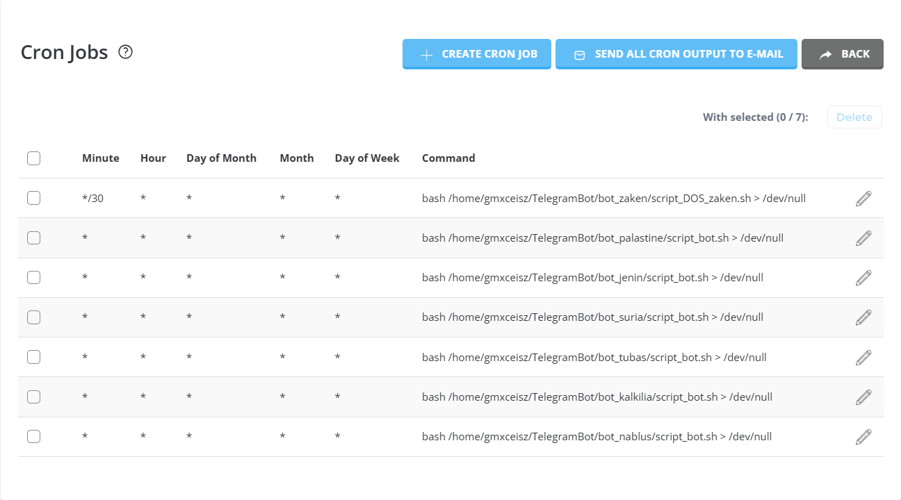

# Telegram Translator Bot Project

Welcome to the **Telegram Translator Bot Project**! 🚀
This project includes a set of Telegram bots designed to automate various tasks efficiently, with the main purpose of providing a concise way to consume news from various media sources.

## 📌 Features
- 📩 Automated message handling
- 🔧 Custom commands and responses
- 🌐 Integration with external APIs
- 🛠 Easy to deploy and customize
- 🌎 Auto Translation from every language to every language

## 🛠 How to Create Your Own Telegram Bot
Follow these steps to create and set up your own Telegram bot:

### 1️⃣ Set Up the Bot on Your Server
1. 📥 Clone this repository:
   ```bash
   git clone https://github.com/avishaigonen123/TelegramBot.git
   cd TelegramBot
   ```
2. 📦 Install dependencies:
   ```bash
   python3 -m pip install --user googletrans==4.0.0-rc1
   python3 -m pip install --user telethon
   ```
3. 📝 Create a `config.py` file by copying `config_sample.py` and updating your details:
   ```bash
   cp config_sample.py config.py
   ```
   Update `config.py` with your API details:
   ```python
   API_ID = <your_api_id>
   API_HASH = '<your_api_hash>'
   PHONE_NUMBER = '<your_phone_number>'
   SOURCE_CHANNEL_ID = <source_channel_id>
   DEST_CHANNEL_ID = <destination_channel_id>
   ```
4. 🔑 Run the `create_sessions.py` script to generate session files:
   ```bash
   python create_sessions.py
   ```
   You will receive a secret code on your Telegram application for each session. Enter this code into the program to create a session.
   Take the session names printed by the script and add them to `bot.py`:
   ```python
   sessions_list = ['your_session_1.session', 'your_session_2.session', 'your_session_3.session']
   ```
5. ▶️ Run the bot:
   ```bash
   python bot.py
   ```

### 2️⃣ Deploying the Bot Online
To keep the bot running 24/7, you may deploy it on a cloud server. A free option is **webhostmost.com**, which provides free hosting services.

To automate script execution, you can use **cron jobs**. The bot scripts run once per minute, and an additional script for a friend runs every half hour.


## 🔗 Join Our Telegram Groups
Stay updated and get support by joining our Telegram groups:
- 📢 **Jenin News:** [Join Here](https://t.me/+MGnQsMZ5FL5mNjk8)
- 📢 **Kalkilia News:** [Join Here](https://t.me/+MGnQsMZ5FL5mNjk8)
- 📢 **Tubas News:** [Join Here](https://t.me/+MGnQsMZ5FL5mNjk8)
- 📢 **Nablus News:** [Join Here](https://t.me/+MGnQsMZ5FL5mNjk8)
- 📢 **Gaza News:** [Join Here](https://t.me/+MGnQsMZ5FL5mNjk8)
- 📢 **Suria News:** [Join Here](https://t.me/+MGnQsMZ5FL5mNjk8)

## 📸 Telegram Channels
Here are images of our official Telegram channels:


## 📜 License
This project is licensed under the MIT License. Feel free to contribute and improve it!

---
For any issues or questions, feel free to reach out and open an issue! 💬

