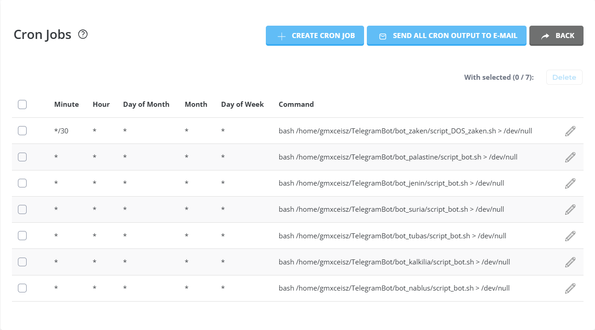

# Telegram Translator Bot Project

Welcome to the **Telegram Translator Bot Project**! 🚀
This project includes a set of Telegram bots designed to automate various tasks efficiently, with the main purpose of providing a concise way to consume news from various media sources.

## 📌 Features
- 📩 Automated message handling
- 🔧 Custom commands and responses
- 🌐 Integration with external APIs
- 🛠 Easy to deploy and customize
- 🌎 Auto Translation from every language to every language

## 🛠 How to Set It Up

All channels share **one** Telegram account and **one** consolidated process (`bot/run_tick.py`), triggered by cron once a minute. There used to be one script + one login per channel; that's gone — see `DEPLOYMENT.md` for the reasoning if you're curious.

### 1️⃣ Set Up on Your Server
1. 📥 Clone this repository:
   ```bash
   git clone https://github.com/avishaigonen123/TelegramBot.git
   cd TelegramBot
   ```
2. 📦 Install dependencies:
   ```bash
   python3 -m pip install --user -r requirements.txt
   ```
3. 📝 Create `.env` from `.env.example` and fill in your real values (`API_ID`, `API_HASH`, `PHONE_NUMBER`, `OPENROUTER_API_KEYS`).
4. ➕ Add your channels to `config/channels.json`:
   ```json
   {"name": "example", "source_id": <source_channel_id>, "dest_id": <destination_channel_id>}
   ```
5. 🔑 Create the shared session (one-time, interactive — you'll get a login code in Telegram):
   ```bash
   python3 create_session.py
   ```
6. ▶️ Run one tick manually to confirm it works. Use `--channel <name>` to test a single channel only — running without it processes every channel in `config/channels.json`, including your real live ones:
   ```bash
   python3 bot/run_tick.py --channel jenin
   ```

### 2️⃣ How to Get the ID of a Channel or User
1. Open your **Telegram app**.
2. Forward a message from the desired channel or user to the **[MyIDBot](https://t.me/myidbot)**.
3. **MyIDBot** will reply with the **ID** of the forwarded message's sender (channel or user).

Use that ID as `source_id`/`dest_id` in `config/channels.json`.

### 3️⃣ Deploying Online
See `DEPLOYMENT.md` for the full webhostmost rollout (crontab, secrets, session upload). In short: one cron line runs `bot/run_tick.py` every minute (see `crontab.txt`), and a GitHub Actions workflow (`.github/workflows/keep_alive.yml`) handles resetting the free-tier suspension timer daily — no more relying on a manually-run Selenium script.



## 🔗 Join Our Telegram Groups
Stay updated and get support by joining our Telegram groups:
- 📢 **Jenin News:** [Join Here](https://t.me/+MGnQsMZ5FL5mNjk8)
- 📢 **Salfit News:** [Join Here](https://t.me/+yJXGlxsV12YwYWJk)
- 📢 **Kalkilia News:** [Join Here](https://t.me/+OfUzBG9yTZU1MDk0)
- 📢 **Tubas News:** [Join Here](https://t.me/+4UH5xt-sfTQyMDNk)
- 📢 **Nablus News:** [Join Here](https://t.me/+9vULSIuHQ7RlYjI0)
- 📢 **Gaza News:** [Join Here](https://t.me/+_b4ZozXYKi41OGM0)
- 📢 **Suria News:** [Join Here](https://t.me/+MPKAi42velpmMGI0)
- 📢 **Iran News:** [Join Here](https://t.me/+a-fAkmiPVu1kMDZk)
- 📢 **Naya News:** [Join Here](https://t.me/+iM3lb6VCnO1lZWI0)
- 📢 **Iran Truth checker:** [Join Here](https://t.me/+Dlp5D-l5RYQwOWQ0)

## 📜 License
This project is licensed under the MIT License. Feel free to contribute and improve it!

---
For any issues or questions, feel free to reach out and open an issue! 💬

